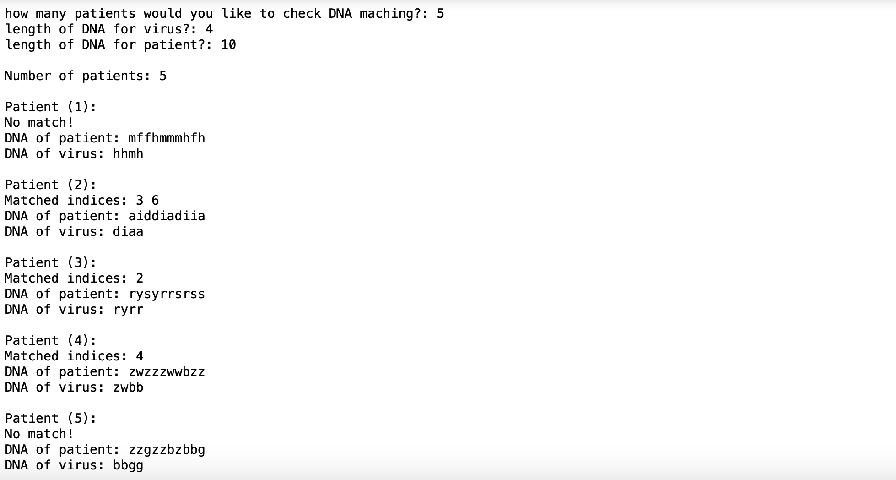

## Description

This program is developed to solve the problem in following link:
[Hackerrank Save Humanity Problem](https://www.hackerrank.com/challenges/save-humanity/problem)

- Problem Author: Hackerrank
- Problem Difficulty: Expert

## About Program

save-humanity-first-attempt.py & save-humanity.py:
The only difference between two file is syntax of script. The use of save-humanity.py make it more elegant.

save-humanity-random-ascii.py:
This code is for demostaration purpose on how the code actually works. Random string generation is used for faster run. DNAs of any length are genereated from ascii letter list to make multiple tests in shoerter time.

This code got score of 22.31 from Hackerrank.

## Snapshot

- From save-humanity-random-ascii.py:

